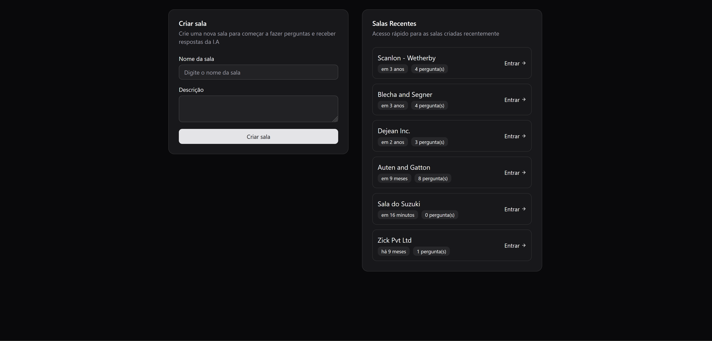

## Agents Frontend
App Frontend da Aplicação de Perguntas e Respostas com I.A desenvolvido durante a NLW Agents da Rocketseat

<h1 align="center">
  
</h1>

<br /><br />

## 🚀 Tecnologias
- [TypeScript](https://www.typescriptlang.org/) > Linguagem Principal da Aplicação
- [Vite](https://vite.dev/) > Framework com React para criação do Layout 
- [TailwindCSS](https://tailwindcss.com/) > Extensão para o NextJS para estilização das páginas
- [Shadcn](https://ui-v4.shadcn.com/) > Biblioteca de Componentes para o NextJS
- [Lucide-React](https://lucide.dev/guide/packages/lucide-react) > Biblioteca de ícones
- [Zod](https://zod.dev/) > Biblioteca para Validação de Esquemas TypeScript
- [Ky](https://github.com/sindresorhus/ky) > Biblioteca HTTP para requisições à API


<br /><br />

## 💻 Executando o Projeto

#### 1º Passo - Configure o projeto backend:

https://github.com/thiago-suzuki/nlw-agents-backend

#### 2º Passo - Configure as Ferramentas necessárias para rodar o projeto:

- [Node.js](https://nodejs.org/en/) (Versão 22)


#### 3º Passo - Instale as Dependências:

```bash
$ npm install
```

#### 4º Passo - Configure o arquivo .env:

```bash
VITE_API_URL=http://localhost:3333
```

#### 5º Passo - Rode o projeto:

```bash
# development
$ npm run dev
```

<br /><br />

## Link do Deploy
https://agents-ia-nu.vercel.app/